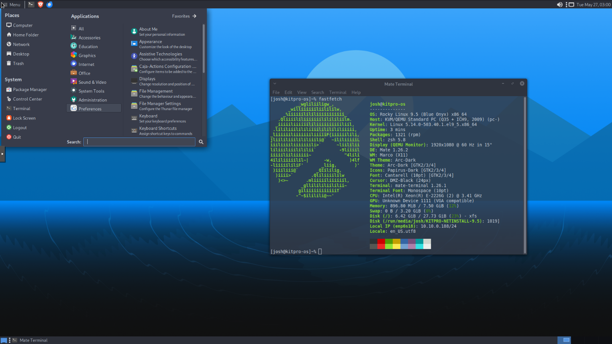

# KITpro OS

KITpro OS is a lightweight, user-friendly Linux distribution based on Rocky Linux 9.5. It offers polished desktop environments (MATE and XFCE), pre-installed desktop apps, system-wide theming, and first-boot customization—all geared toward productivity, consistency, and simplicity.

[Download KITpro OS](https://os.kitpro.us/)



This repository contains the full build source, including RPMs, branding assets, ISO customization scripts, and validation tools.

---

## Features

- Built from Rocky Linux 9.5 (RHEL-compatible)
- Available in MATE and XFCE spins
- Custom LightDM login screen and greeters
- KITpro branding: wallpapers, icon sets, terminal tweaks, GTK themes
- Default apps: Brave, LibreOffice, VLC, KeepassXC, Thunderbird, Fastfetch
- Zsh configured with powerline fonts and theming
- Docker and Flatpak pre-installed
- Optional initial setup screen (initial-setup-gui)
- Dual or single desktop environment ISO builds
- ISO validation script with structure and package checks

---

## Directory Structure

```
kitpro-os/
├── branding/        # Themes, LightDM config, wallpapers, dconf, fastfetch, zsh
│   ├── assets/      # Logos and image files
│   ├── common/      # GTK settings, wallpapers, fastfetch config, zshrc
│   ├── lightdm/     # Greeter configs and themes
│   ├── mate/        # Dconf dumps and desktop tweaks for MATE
│   ├── xfce4/       # XFCE configs and layout
│   └── packages/    # Custom RPMs (arc-theme, mate-menu, branding)
├── comps/           # Custom comps.xml files for group metadata
├── kickstarts/      # Kickstart files: MATE, XFCE, and Netinstall variants
├── repos/           # Local repo structure with BaseOS, AppStream, and Packages
├── rpmbuild/        # Full RPM build tree (SPECS, SOURCES, RPMS, SRPMS, logs)
├── scripts/         # Build helpers for individual spins
├── iso/             # Final ISO output
├── output/          # Temporary working directory for ISO creation
├── tmp/, work/      # Scratch directories for ISO generation
├── dual-build.sh    # Full XFCE+MATE dual ISO build script
├── validate_iso.sh  # ISO sanity checker (treeinfo, structure, packages)
├── sync-rocky-repos.sh # Pulls BaseOS/AppStream for offline builds
└── README.md
```

---

## Building an ISO

### Step 1: Sync Repos
```bash
./sync-rocky-repos.sh
```
This will sync BaseOS and AppStream content for offline/local usage.

### Step 2: Build Dual ISO
```bash
./dual-build.sh
```
This builds a hybrid ISO with both MATE and XFCE included. Output goes to `/opt/output/KITproOS-9.5-dual.iso`.

### Step 3: Build Single ISOs (Optional)
```bash
sudo bash scripts/build-kitpro-mate-iso.sh
sudo bash scripts/build-kitpro-xfce-iso.sh
sudo bash scripts/build-kitpro-netinstall.sh
```

### Required Packages
Install on a Rocky Linux 9.x build host:

```
sudo dnf install lorax genisoimage createrepo_c mkksiso anaconda pykickstart -y
```

---

## ISO Validation

After building, run the ISO validation script to check structure, boot files, treeinfo, and packages:
```bash
./validate_iso.sh
```
This script will output a log file in your home directory and report any errors found.

---

## Custom Packages

KITpro OS includes the following custom RPMs:

- `kitpro-branding`: wallpapers, GTK settings, LightDM configs, fastfetch, zsh
- `arc-theme`: ported and repackaged Arc GTK theme
- `mate-menu`: GTK3 menu for MATE (modern Brisk Menu fork)

All `.spec` files and SRPMs can be found under `rpmbuild/SPECS/` and `rpmbuild/SRPMS/`.

---

## Repository

KITpro OS uses a custom repository hosted at:

https://repo.kitpro.us/9/x86_64/

This repo contains all RPMs and metadata used by the installer.

---

## License

All original assets and code in this repository are licensed under the MIT License unless otherwise noted. Refer to individual spec files and source archives for third-party license notices.

---

## Maintainer

Joshua Lacy (KeepItTechie)  
https://www.keepittechie.com
